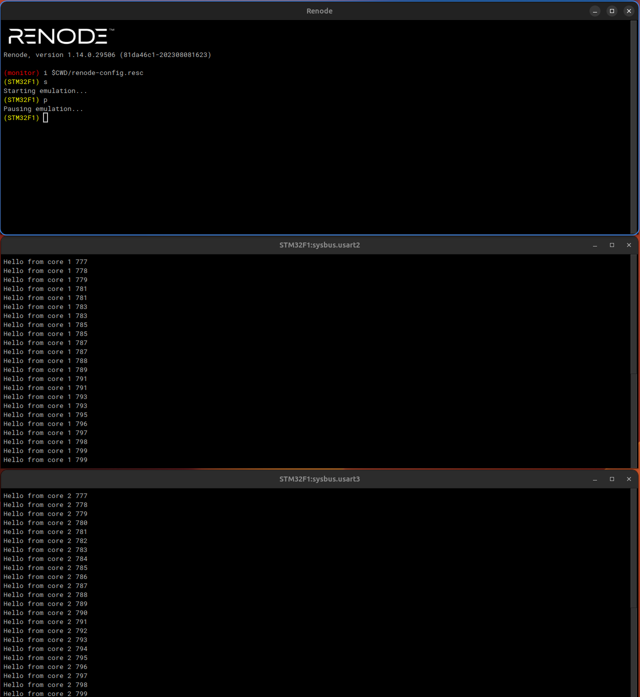

### Dual Core Cortex-m3 Rust+Renode Project

The core concept of this experiment involves leveraging the established single-core stm32f1xx microcontroller design as a foundation for developing a Renode emulation of a Dual Core Cortex M3 Microcontroller.

After thorough consideration, the proposed design and memory layout entail the following components:
- Core-local FLASH, RAM, NVIC, and shared peripherals, along with a shared RAM.

The rationale for this approach is two fold:

1. **Minimal Linker Script Modification:** The design requires the LEAST amount of linker script modification (actually only one linker script is needed) in order to be able to compile totally different binaries for the two cores and not worry about any interference + the possibility of having some shared data section for communication between the two cores.

2. **Transparency to stm32f1hal:** The design remains entirely transparent to stm32f1hal. Meaning The same existing rust API for programming single core stm32f1 MCUs can be used, and this allows very fast prototyping as it brings all the support needed for validing this multicore idea.


### Running the emulation

Assuming you have renode installed in your linux environment

```bash
# build the core1 and core2 binaries
cargo build

# Start renode and configure the emulation
renode/run.sh
```

Start the emulation From renode terminal
```
(renode) start
```

**Experiment:** some shared data is incremented ONLY by core2, but its read and displayed by both cores over uart (core1-> usart2 | core2-> usart3)



